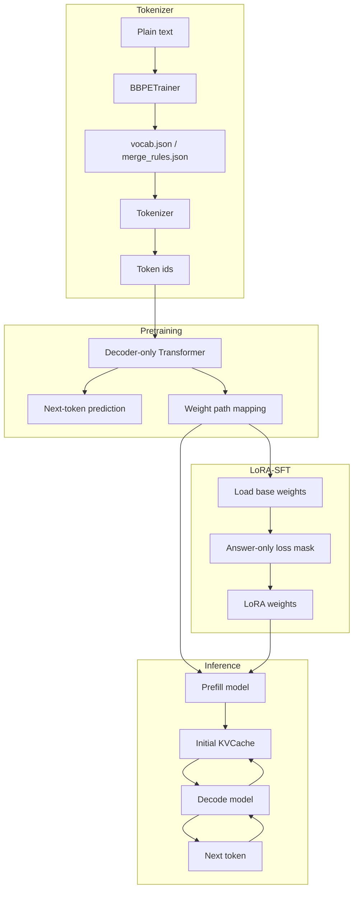

# Mini LLM Demo

这是一个基于 Keras / TensorFlow 实现的 mini LLM demo，覆盖从 tokenizer、decoder-only Transformer 预训练、LoRA-SFT，到 prefill / decode KVCache 推理的完整主链路。

## 项目亮点

- 从零实现 Byte-level BPE tokenizer：包含 vocab / merge rules 训练、编码解码，并在 trainer 中使用双向链表、pair 位置索引和 lazy heap，避免每轮全量扫描语料。
- 实现 decoder-only Transformer，包括 RMSNorm、RoPE、SwiGLU、causal mask 和 padding mask。
- 支持 next-token prediction 预训练流程。
- 支持 LoRA-SFT：构造 instruction 数据，使用 answer-only loss mask，只训练 LoRA 参数，并单独保存 / 加载 LoRA 权重。
- 拆分 prefill / decode 推理模型，并实现固定长度 KVCache 更新。
- 使用 Keras 权重路径映射，在 pretrain / LoRA-SFT / prefill / decode 模型之间迁移参数。

## 整体链路



## 快速开始

安装依赖：

```bash
pip install -r requirements.txt
```

准备纯文本数据到 `data/` 后，先训练 tokenizer：

```bash
python bbpe_trainer.py
```

然后进行 next-token prediction 预训练：

```bash
python pretrain.py
```

可选：在预训练权重基础上进行 LoRA-SFT：

```bash
python lora_sft.py
```

最后运行推理入口。`interface.py` 可以只加载 base 权重，也可以额外加载 LoRA 权重：

```bash
python interface.py
```

## 项目结构

```text
.
├── README.md
├── requirements.txt
├── pretrain.py                 # 预训练入口
├── lora_sft.py                 # LoRA-SFT 入口
├── interface.py                # 推理入口
├── tokenizer.py                # BBPE tokenizer 编码/解码
├── bbpe_trainer.py             # BBPE vocab 与 merge rules 训练
├── models.py                   # pretrain model
├── inference_models.py         # prefill / decode inference model
├── transformblock.py           # Transformer block 组合
├── attention.py                # RoPE attention 与 KVCache attention
├── layers.py                   # RMSNormalization, SwiGLU
├── rope.py                     # RoPE 实现
├── train_utils.py              # 数据加载与训练 batch 生成
├── callbacks.py                # 训练时采样与权重保存 callback
├── losses.py                   # padding-aware loss
├── metrics.py                  # padding-aware accuracy
├── sample_utils.py             # top-k sampling
├── weight_utils.py             # 权重映射保存/加载
├── lora_utils.py               # LoRA 参数冻结与权重保存/加载
├── docs/
│   ├── bbpe.md                 # BBPE 原理与实现
│   ├── rope.md                 # 绝对位置编码与 RoPE
│   ├── kvcache.md              # KVCache 推理机制
│   └── inference.md            # 推理主流程
└── experiments/                # 实验脚本与调试脚本
```

## 文档

- [BBPE 原理与实现](docs/bbpe.md)
- [绝对位置编码与 RoPE](docs/rope.md)
- [KVCache 推理机制](docs/kvcache.md)
- [推理主流程](docs/inference.md)

## 核心流程

### 1. 训练 BBPE tokenizer

`bbpe_trainer.py` 会从文本数据中统计 byte pair，并生成：

```text
config/vocab.json
config/merge_rules.json
```

这两个文件属于 tokenizer 训练产物，默认不随仓库提交。

运行：

```bash
python bbpe_trainer.py
```

当前 tokenizer 是 byte-level BPE，因此基础词表从 0-255 的 byte 开始，再通过 merge rules 扩展词表。

详细说明见：[BBPE 原理与实现](docs/bbpe.md)。

### 2. 预训练语言模型

`pretrain.py` 使用 next token prediction 训练 decoder-only Transformer。

运行：

```bash
python pretrain.py
```

训练时会保存两类权重文件：

```text
models/{epoch}_model.weights.h5
models/{epoch}_k2v.pkl
```

其中：

- `.weights.h5` 是 Keras 原生权重文件
- `_k2v.pkl` 是 `{weight.path: ndarray}` 形式的权重映射

推理模型使用 `_k2v.pkl` 进行权重迁移，用于在 pretrain model、prefill model、decode model 之间按权重路径对齐参数。

### 3. LoRA-SFT

`lora_sft.py` 在预训练权重基础上进行 instruction tuning。当前实现采用：

- messages 格式数据
- prompt + answer + eos 拼接
- answer-only loss mask
- base 权重冻结
- 只训练路径中包含 `lora_` 的参数
- LoRA 权重单独保存到 `lora_weights/`

运行：

```bash
python lora_sft.py
```

训练前需要准备 SFT jsonl 数据，并在 `lora_sft.py` 中配置：

```text
weight_map_path
data_path
```

训练结束后得到的 LoRA 权重可以在 `interface.py` 中通过 `lora_weights_path` 加载。

### 4. KVCache 推理

`interface.py` 负责推理流程：

1. 对 prompt 做 tokenizer 编码
2. 使用 `Prefill_Model` 计算 prompt 阶段 logits、kcache、vcache
3. 将 cache padding 到固定 `max_len`
4. 使用 `Decode_Model` 单 token decode
5. 每一步更新 KVCache
6. 对 batch 内已结束样本进行裁剪

运行：

```bash
python interface.py
```

## 模型结构

模型是一个小型 decoder-only Transformer：

```text
token ids
  -> Embedding
  -> TransformerBlock x N
      -> RMSNorm
      -> RoPE Self-Attention
      -> Residual
      -> RMSNorm
      -> SwiGLU FFN
      -> Residual
  -> tied lm head
  -> logits
```

当前默认配置在 `pretrain.py` 中：

```python
num_block = 4
num_head = 2
embedding_size = 64
context_size = 100
batch_size = 64
```

这是用于本地快速验证的默认小配置，可以按机器资源调整模型规模与训练数据。

## BBPE 实现特点

`bbpe_trainer.py` 中的 `BBPETrainer` 负责训练 byte-level BPE 的 vocab 和 merge rules。整体流程是：

```text
load_segments
  -> build_linked_segments
  -> train
  -> save
```

其中 `load_segments()` 负责读取文本、按 regex 切分 segment 并统计频数；`build_linked_segments()` 将每个 segment 转成双向链表，并初始化 pair 频数与 pair 出现位置索引。

这个实现不是最朴素的每轮全量扫描，而是维护了：

- `Node`：双向链表节点
- `Segment`：一个文本片段对应的链表
- `pair2freq`：pair 到频数的映射
- `pair2nodes`：pair 到出现位置节点的映射
- `freq2pair_heap`：按频数取最大 pair 的 heap
- lazy heap update：避免每次 pair 频数变化都重建 heap

这样可以在 merge 时只局部更新受影响的 pair，而不是每一轮重新扫描全部文本。

`update()` 是 BBPE 训练中最核心的部分：它在合并一个 pair 时，需要同时更新链表结构、`segment.head / segment.tail`、`pair2freq`、`pair2nodes` 和 heap。这里属于状态同步密集型逻辑，因此代码刻意保留在同一个核心流程中，避免拆得过碎导致边界关系更难追踪。

## RoPE 实现特点

RoPE 在 `rope.py` 中实现：

```python
left, right = tf.split(q, 2, axis=-1)
complex_q = tf.complex(left, right)
rotate_q = complex_q * tf.exp(...)
```

实现思路是把 hidden dim 的前后两半组成复数，然后按 position 做复数旋转。

在 prefill 阶段，position 来自序列位置：

```text
0, 1, 2, ..., t-1
```

在 decode 阶段，输入只有当前 token，因此 position 使用：

```text
cur_valid_len - 1
```

## KVCache 设计

推理阶段分为两个模型：

- `Prefill_Model`：处理完整 prompt，生成初始 KVCache
- `Decode_Model`：每次只处理一个新 token，并更新 KVCache

外部 cache shape 使用：

```text
(batch, layer, max_time, head, head_dim)
```

decode attention 内部会转成：

```text
(layer, max_time, batch, head, head_dim)
```

这样便于按当前层更新 cache。

decode 阶段不再需要 causal mask，因为每次只输入当前 token；只需要根据 `cur_valid_len` 构造 valid key mask，屏蔽 cache 中尚未写入的位置。

详细说明见：[KVCache 推理机制](docs/kvcache.md) 和 [推理主流程](docs/inference.md)。

## 数据、配置与模型文件

仓库只保留源码和说明文档，不包含本地训练文件：

- 训练语料
- SFT 数据
- 模型权重
- LoRA 权重
- tokenizer 生成的 vocab / merge rules
- 本地缓存文件

这些文件默认由 `.gitignore` 排除：

```text
data/
SFT_data/
models/
lora_weights/
config/*.json
__pycache__/
.DS_Store
*.txt
```

使用时准备纯文本数据，先运行 `bbpe_trainer.py` 生成 tokenizer 配置，再运行 `pretrain.py` 训练模型。

## Roadmap

- DPO：chosen / rejected 偏好数据训练
- RAG：文档切分、检索、拼接 prompt、生成对比
- 增加最小运行示例
- 增加 tokenizer 单元测试
- 增加 prefill/decode cache shape 检查
- 完善特殊 token 与 BBPE merge 的处理

## 说明

这个项目聚焦 mini LLM 的关键工程链路：

```text
BBPE tokenizer
  -> decoder-only Transformer pretraining
  -> weight mapping
  -> prefill / decode model
  -> KVCache inference
```

项目代码尽量保持直接、可读，适合作为理解 tokenizer、Transformer 训练和 KVCache 推理流程的小型参考。
