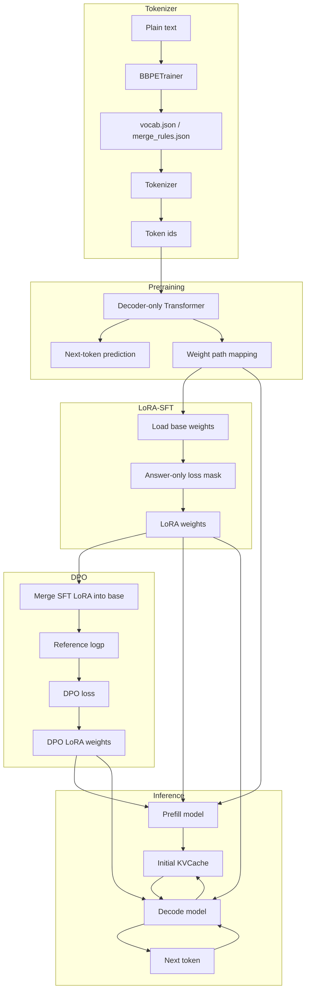

# Keras Mini LLM

这是一个基于 Keras / TensorFlow 实现的 mini LLM demo，覆盖从 tokenizer、decoder-only Transformer 预训练、LoRA-SFT、LoRA-DPO，到 prefill / decode KVCache 推理的完整主链路。

项目当前使用金庸武侠作品文本作为预训练语料，并配套提供武侠领域的 SFT / DPO 数据。数据仅用于本地学习和 demo 验证。

## 项目亮点

- 从零实现 Byte-level BPE tokenizer：包含 vocab / merge rules 训练、编码解码，并在 trainer 中使用双向链表、pair 位置索引和 lazy heap，避免每轮全量扫描语料。
- 实现 decoder-only Transformer，包括 RMSNorm、RoPE、SwiGLU、causal mask 和 padding mask。
- 支持 next-token prediction 预训练流程。
- 支持 LoRA-SFT：构造 instruction 数据，使用 answer-only loss mask，在 Attention 和 SwiGLU 中接入 LoRA，只训练 LoRA 参数，并单独保存 / 加载 LoRA 权重。
- 支持 LoRA-DPO：构造 chosen / rejected 偏好数据，预计算 reference logp，使用 DPO loss 继续训练 LoRA 参数。
- 拆分 prefill / decode 推理模型，并实现固定长度 KVCache 更新。
- 使用 Keras 权重路径映射，在 pretrain / LoRA-SFT / prefill / decode 模型之间迁移参数。

## 整体链路



## 快速开始

建议使用 Python 3.10+，并在虚拟环境中安装依赖：

```bash
python -m venv .venv
source .venv/bin/activate
```

安装依赖：

```bash
pip install -r requirements.txt
```

项目已在 `data/` 中配置武侠小说预训练文本。你也可以替换成自己的纯文本数据。先训练 tokenizer：

```bash
python bbpe_trainer.py
```

然后进行 next-token prediction 预训练：

```bash
python pretrain.py
```

可选：在预训练权重基础上进行 LoRA-SFT：

```bash
python lora_sft.py
```

可选：在 SFT 模型基础上进行 LoRA-DPO：

```bash
python lora_dpo.py
```

`lora_sft.py` 训练结束后会自动生成 merged SFT 权重；`merge_lora_checkpoint.py` 仅用于需要手动重新合并已有 base/LoRA 权重的场景。

最后运行推理入口。`interface.py` 可以只加载 base 权重，也可以额外加载 LoRA 权重：

```bash
python interface.py
```

也可以用 `demo.py` 串起从 tokenizer 训练、预训练、LoRA-SFT、LoRA-DPO 到推理的本地端到端流程：

```bash
python demo.py
```

`demo.py` 依赖本地数据、tokenizer 配置和模型权重目录。仓库当前提供武侠小说预训练语料与配套 SFT / DPO 数据，权重文件可按本地训练结果生成或替换。详细说明见：[端到端 demo](../docs/demo.md)。

> `demo.py` 默认每个训练阶段只运行 1 个 epoch，主要用于验证代码链路是否畅通，不代表模型已经充分训练。完整训练可分别调整 `pretrain.py`、`lora_sft.py` 和 `lora_dpo.py` 中的 epoch、batch size 与模型配置。

## 项目结构

```text
.
├── README.md
├── requirements.txt
├── demo.py                     # 本地端到端流程示例
├── pretrain.py                 # 预训练入口
├── lora_sft.py                 # LoRA-SFT 入口
├── lora_dpo.py                 # LoRA-DPO 入口
├── merge_lora_checkpoint.py    # 合并 base 权重与 LoRA 权重
├── interface.py                # 推理入口
├── tokenizer.py                # BBPE tokenizer 编码/解码
├── bbpe_trainer.py             # BBPE vocab 与 merge rules 训练
├── models.py                   # pretrain model
├── inference_models.py         # prefill / decode inference model
├── transformblock.py           # Transformer block 组合
├── attention.py                # RoPE attention 与 KVCache attention
├── layers.py                   # RMSNormalization, SwiGLU
├── rope.py                     # RoPE 实现
├── train_utils.py              # 数据加载与训练 batch 生成
├── callbacks.py                # 训练时采样与权重保存 callback
├── losses.py                   # pretrain / SFT / DPO loss
├── metrics.py                  # padding-aware accuracy
├── sample_utils.py             # top-k sampling
├── weight_utils.py             # 权重映射保存/加载
├── lora_utils.py               # LoRA 参数冻结、保存/加载与合并
├── data/                       # 武侠小说预训练文本
├── SFT_data/                   # SFT jsonl 示例数据
├── DPO_data/                   # DPO chosen/rejected jsonl 示例数据
├── tokenizer_config/           # tokenizer vocab / merge rules
└── experiments/                # 实验脚本与调试脚本
```

## 文档

Keras 与 PyTorch 共用的实现文档统一位于仓库根目录 `docs/`：

- [BBPE 原理与实现](../docs/bbpe.md)
- [绝对位置编码与 RoPE](../docs/rope.md)
- [KVCache 推理机制](../docs/kvcache.md)
- [LoRA-SFT 原理与实现](../docs/lora_sft.md)
- [LoRA-DPO 原理与实现](../docs/lora_dpo.md)
- [端到端 demo](../docs/demo.md)
- [推理主流程](../docs/inference.md)

## 核心流程

### 1. 训练 BBPE tokenizer

`bbpe_trainer.py` 会从文本数据中统计 byte pair，并生成：

```text
tokenizer_config/vocab.json
tokenizer_config/merge_rules.json
```

这两个文件属于 tokenizer 训练结果。当前 demo 可以直接提交一份小型 tokenizer 配置用于复现实验；如果替换成大规模数据训练出的配置，也可以按需要改为本地生成。

运行：

```bash
python bbpe_trainer.py
```

当前 tokenizer 是 byte-level BPE，因此基础词表从 0-255 的 byte 开始，再通过 merge rules 扩展词表。

详细说明见：[BBPE 原理与实现](../docs/bbpe.md)。

### 2. 预训练语言模型

`pretrain.py` 使用 next token prediction 训练 decoder-only Transformer。

运行：

```bash
python pretrain.py
```

训练时会保存两类权重文件：

```text
models/{epoch}_model.weights.h5
models/{epoch}_k2v_weights.pkl
```

其中：

- `.weights.h5` 是 Keras 原生权重文件
- `_k2v_weights.pkl` 是 `{weight.path: ndarray}` 形式的权重映射

推理模型使用 `_k2v_weights.pkl` 进行权重迁移，用于在 pretrain model、prefill model、decode model 之间按权重路径对齐参数。

### 3. LoRA-SFT

`lora_sft.py` 在预训练权重基础上进行 instruction tuning。当前实现采用：

- messages 格式数据
- prompt + answer + eos 拼接
- answer-only loss mask
- Attention q/k/v/out LoRA
- SwiGLU gate/out LoRA
- base 权重冻结
- 只训练路径中包含 `lora_` 的参数
- LoRA-SFT 权重单独保存到 `lora_sft_weights/`

运行：

```bash
python lora_sft.py
```

训练前需要准备 SFT jsonl 数据，并在 `lora_sft.py` 中配置：

```text
weight_map_path
data_path
```

当前仓库提供一份武侠领域 SFT 数据：

```text
SFT_data/sft_data.jsonl
```

训练结束后得到的 LoRA 权重可以在 `interface.py` 中通过 `lora_weights_path` 加载。

### 4. LoRA-DPO

`lora_dpo.py` 在 SFT 模型基础上继续做 LoRA-DPO。当前实现采用：

- chosen / rejected 数据格式
- `prompt + answer + eos` 序列构造
- answer-only mask
- 训练前预计算 reference model 的 token-level logp
- 当前 policy model 实时计算 chosen / rejected logp
- 使用 DPO loss 优化 LoRA 参数
- DPO LoRA 权重单独保存到 `lora_dpo_weights/`

`lora_sft.py` 训练结束后会自动把 SFT LoRA 合并进 base 权重，得到 DPO 所需的 SFT merged base。若只有旧的 LoRA 增量权重，也可以手动执行：

```bash
python merge_lora_checkpoint.py
```

然后基于这个 merged base 训练新的 DPO LoRA：

```bash
python lora_dpo.py
```

LoRA-DPO 的实现细节见：[LoRA-DPO 原理与实现](../docs/lora_dpo.md)。

当前仓库提供一份武侠领域 DPO 数据：

```text
DPO_data/dpo_data.jsonl
```

### 5. KVCache 推理

`interface.py` 负责推理流程：

1. 对 prompt 做 tokenizer 编码
2. 使用 `Prefill_Model` 计算 prompt 阶段 logits、kcache、vcache
3. 将 cache padding 到固定 `max_len`
4. 使用 `Decode_Model` 单 token decode
5. 每一步更新 KVCache
6. 对 batch 内已结束样本进行裁剪

运行：

```bash
python interface.py
```

## 模型结构

模型是一个小型 decoder-only Transformer：

```text
token ids
  -> Embedding
  -> TransformerBlock x N
      -> RMSNorm
      -> RoPE Self-Attention (+ optional LoRA)
      -> Residual
      -> RMSNorm
      -> SwiGLU FFN (+ optional LoRA)
      -> Residual
  -> tied lm head
  -> logits
```

当前默认配置在 `pretrain.py` 中：

```python
num_block = 4
num_head = 2
embedding_size = 64
context_size = 200
batch_size = 128
```

这是用于本地快速验证的默认小配置，可以按机器资源调整模型规模与训练数据。

## LoRA-SFT 实现特点

LoRA 只在 `use_lora=True` 时参与前向计算。预训练阶段默认不启用 LoRA，因此 base 权重文件只保存原始模型参数；SFT 阶段先加载 base 权重，再冻结非 LoRA 参数，只训练路径中包含 `lora_` 的权重。

当前 LoRA 接入位置包括：

- Attention: `q / k / v / out`
- SwiGLU: `gate_v / gate_w / out`

LoRA 的 B 矩阵使用 zero initialization，因此刚启用 LoRA 且尚未训练时，模型输出仍等价于 base model。LoRA 权重会单独保存为 `{weight.path: ndarray}` 形式，推理时可以在加载 base 权重之后再叠加 LoRA 权重。

## BBPE 实现特点

`bbpe_trainer.py` 中的 `BBPETrainer` 负责训练 byte-level BPE 的 vocab 和 merge rules。整体流程是：

```text
load_segments
  -> build_linked_segments
  -> train
  -> save
```

其中 `load_segments()` 负责读取文本、按 regex 切分 segment 并统计频数；`build_linked_segments()` 将每个 segment 转成双向链表，并初始化 pair 频数与 pair 出现位置索引。

这个实现不是最朴素的每轮全量扫描，而是维护了：

- `Node`：双向链表节点
- `Segment`：一个文本片段对应的链表
- `pair2freq`：pair 到频数的映射
- `pair2nodes`：pair 到出现位置节点的映射
- `freq2pair_heap`：按频数取最大 pair 的 heap
- lazy heap update：避免每次 pair 频数变化都重建 heap

这样可以在 merge 时只局部更新受影响的 pair，而不是每一轮重新扫描全部文本。

`update()` 是 BBPE 训练中最核心的部分：它在合并一个 pair 时，需要同时更新链表结构、`segment.head / segment.tail`、`pair2freq`、`pair2nodes` 和 heap。这里属于状态同步密集型逻辑，因此代码刻意保留在同一个核心流程中，避免拆得过碎导致边界关系更难追踪。

特殊 token 只通过代码显式拼接 id 进入序列，不通过文本字符串进入 tokenizer。例如：

```python
ids = tokenizer.encode_text(text)
ids = ids + [tokenizer.special_ids["<eos>"]]
```

如果原始文本中出现 `"<eos>"` 这类可见字符串，它会被当作普通文本编码，不会被识别成控制 token。因此 BBPE 训练只处理普通文本，`<bos>`、`<eos>`、`<unk>`、`<pad>` 不参与普通 byte pair merge。

## RoPE 实现特点

RoPE 在 `rope.py` 中实现：

```python
left, right = tf.split(q, 2, axis=-1)
complex_q = tf.complex(left, right)
rotate_q = complex_q * tf.exp(...)
```

实现思路是把 hidden dim 的前后两半组成复数，然后按 position 做复数旋转。

在 prefill 阶段，position 来自序列位置：

```text
0, 1, 2, ..., t-1
```

在 decode 阶段，输入只有当前 token，因此 position 使用：

```text
cur_valid_len - 1
```

## KVCache 设计

推理阶段分为两个模型：

- `Prefill_Model`：处理完整 prompt，生成初始 KVCache
- `Decode_Model`：每次只处理一个新 token，并更新 KVCache

外部 cache shape 使用：

```text
(batch, layer, max_time, head, head_dim)
```

decode attention 内部会转成：

```text
(layer, max_time, batch, head, head_dim)
```

这样便于按当前层更新 cache。

decode 阶段不再需要 causal mask，因为每次只输入当前 token；只需要根据 `cur_valid_len` 构造 valid key mask，屏蔽 cache 中尚未写入的位置。

详细说明见：[KVCache 推理机制](../docs/kvcache.md) 和 [推理主流程](../docs/inference.md)。

## 数据、配置与模型文件

当前预训练语料位于 `data/`，包含 15 部武侠作品文本，两个框架使用相同的数据集合：

```text
data/*.txt
```

LoRA-SFT / LoRA-DPO 分别读取以下 JSONL 数据：

```text
SFT_data/sft_data.jsonl
DPO_data/dpo_data.jsonl
```

`SFT_data/sft_data.jsonl` 使用 `messages` 格式，共 5200 条；`DPO_data/dpo_data.jsonl` 使用 `prompt/chosen/rejected` 格式，共 5200 条。更换 `data/*.txt` 后应重新训练 tokenizer、预训练模型和后续 LoRA 权重，避免词表与 checkpoint 不匹配。

本地训练过程中还会生成：

- tokenizer 配置：`tokenizer_config/vocab.json`、`tokenizer_config/merge_rules.json`
- base 模型权重：`models/`
- LoRA-SFT 权重：`lora_sft_weights/`
- LoRA-DPO 权重：`lora_dpo_weights/`
- Python 缓存和系统文件：`__pycache__/`、`.DS_Store`

主要权重文件之间的关系如下：

| 阶段 | 默认产物 | 后续用途 |
| --- | --- | --- |
| 预训练 | `models/{epoch}_model.weights.h5` | Keras 原生权重，可用于同结构模型恢复 |
| 预训练 | `models/{epoch}_k2v_weights.pkl` | 按权重路径迁移到 SFT、prefill 和 decode 模型 |
| LoRA-SFT | `lora_sft_weights/{epoch}_lora_weights.pkl` | 在 base 权重上叠加 SFT LoRA |
| SFT 合并 | `lora_sft_weights/{epoch}_k2v_lora_merged_weights.pkl` | 作为 DPO 阶段的 reference/base 权重 |
| LoRA-DPO | `lora_dpo_weights/{epoch}_lora_weights.pkl` | 在 SFT merged base 上叠加 DPO LoRA |
| DPO 合并 | `lora_dpo_weights/{epoch}_k2v_lora_merged_weights.pkl` | 直接以 `use_lora=False` 运行推理 |

独立训练脚本的 callback 会保存 LoRA 增量权重，训练结束后还会执行合并并保存 merged 权重；`demo.py` 采用相同流程。若手动串联各阶段，请确认脚本中的 epoch 编号和文件路径指向实际生成的 checkpoint。

这些文件是否提交到仓库，取决于当前 demo 版本需要。作为工程实践，正式项目中通常会把大模型权重和大规模训练数据放到外部存储，只在仓库中保留下载说明、配置和小样例。

如果替换数据，请只使用自己有权使用的数据。学习用途不等于自动获得分发授权。

## Roadmap

已完成：

- [x] Byte-level BPE tokenizer 训练与编码/解码
- [x] Decoder-only Transformer 预训练
- [x] LoRA-SFT 与 answer-only loss mask
- [x] LoRA-DPO 与 reference logp 预计算
- [x] LoRA 增量权重保存、加载与 merged checkpoint
- [x] Prefill/decode 拆分与 KVCache 推理
- [x] 端到端 `demo.py`
- [x] 提供计算结构对应的 PyTorch 实现

下一步：

- [ ] RAG：文档切分、检索、prompt 拼接与生成效果对比

## 说明

这个项目聚焦 mini LLM 的关键工程链路：

```text
BBPE tokenizer
  -> decoder-only Transformer pretraining
  -> LoRA-SFT
  -> LoRA-DPO
  -> weight mapping
  -> prefill / decode model
  -> KVCache inference
```

项目代码尽量保持直接、可读，适合作为理解 tokenizer、Transformer 训练、LoRA-SFT、LoRA-DPO 和 KVCache 推理流程的小型参考。
